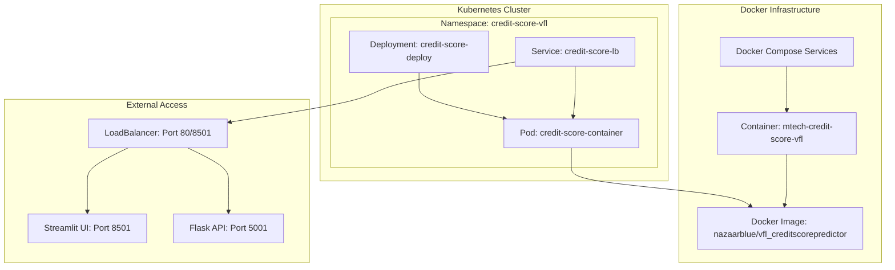
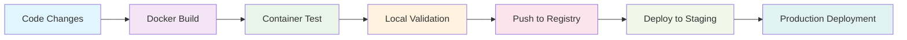
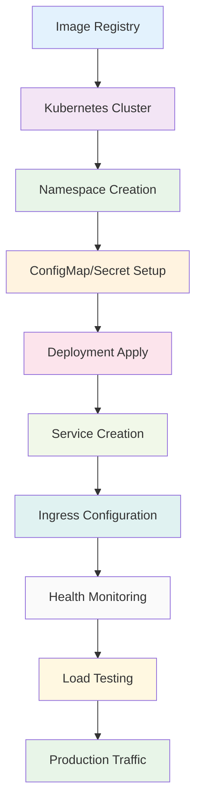

# 3.12 Deployment and Infrastructure

## 3.12.1 Overview

This section documents the comprehensive deployment infrastructure implemented for the MTechCreditScoreVFL project, covering both Docker containerization and Kubernetes orchestration. The deployment architecture ensures scalable, reliable, and maintainable deployment of the VFL credit scoring system across different environments.

## 3.12.2 Deployment Architecture



## 3.12.3 Docker Containerization

### 3.12.3.1 Dockerfile Architecture

The project uses a multi-stage Docker build process optimized for ML workloads:

```dockerfile:1:42:Dockerfile
FROM python:3.10.13-slim

ENV PYTHONUNBUFFERED=1
ENV PYTHONPATH=/app
ENV DEBIAN_FRONTEND=noninteractive

RUN apt-get update && apt-get install -y \
    gcc \
    g++ \
    libgomp1 \
    libblas-dev \
    liblapack-dev \
    libatlas-base-dev \
    && rm -rf /var/lib/apt/lists/*

WORKDIR /app

COPY requirements.txt .
RUN pip install --no-cache-dir -r requirements.txt

COPY . .
RUN mkdir -p /app/logs /app/plots /app/saved_models

RUN echo '#!/bin/bash\n\
echo "Starting MTechCreditScoreVFL services..."\n\
\n\
echo "Starting Flask API server on port 5001..."\n\
python VFLClientModels/models/apis/app.py &\n\
API_PID=$!\n\
\n\
# Wait for API server to start up\n\
sleep 5\n\
\n\
echo "Starting Streamlit UI..."\n\
streamlit run VFLClientModels/models/UI/credit_score_ui.py --server.port 8501 --server.address 0.0.0.0\n\
\n\
# Clean up API process on exit\n\
kill $API_PID\n\
' > /app/start.sh && chmod +x /app/start.sh

EXPOSE 5001 8501
CMD ["/app/start.sh"]
```

**Key Features:**
- **Base Image**: Python 3.10.13-slim for optimized size and security
- **System Dependencies**: BLAS, LAPACK, OpenMP for numerical computing
- **Multi-Service Architecture**: Flask API + Streamlit UI in single container
- **Process Management**: Bash script orchestrates service startup/shutdown
- **Volume Mounts**: Persistent storage for logs, plots, and models

### 3.12.3.2 Docker Compose Configuration

```yaml:1:24:docker-compose.yml
version: '3.8'

services:
  mtech-credit-score:
    build: .
    container_name: mtech-credit-score-vfl
    ports:
      - "5001:5001"  # Flask API
      - "8501:8501"  # Streamlit UI
    environment:
      - PYTHONUNBUFFERED=1
      - OPENAI_API_KEY=${OPENAI_API_KEY:-}
    volumes:
      - ./logs:/app/logs
      - ./plots:/app/plots
      - ./saved_models:/app/saved_models
      - ./data:/app/data
    restart: unless-stopped
    healthcheck:
      test: ["CMD", "curl", "-f", "http://localhost:5001/health"]
      interval: 30s
      timeout: 10s
      retries: 3
      start_period: 60s
```

**Configuration Highlights:**
- **Port Mapping**: API (5001) and UI (8501) exposed
- **Environment Variables**: OpenAI API key support for NLP explanations
- **Volume Persistence**: Host directories mounted for data persistence
- **Health Checks**: Automated health monitoring with restart policies
- **Restart Policy**: Automatic recovery from failures

### 3.12.3.3 Docker Management Scripts

The project includes comprehensive management scripts for operational efficiency:

```bash:49:88:start_docker.sh
# Function to start services
start_services() {
    print_status "Starting MTechCreditScoreVFL services..."
    
    # Check prerequisites
    check_docker
    check_docker_compose
    
    # Check if .env file exists
    if [ ! -f .env ]; then
        print_warning ".env file not found. Creating one with placeholder..."
        echo "# Environment variables for MTechCreditScoreVFL" > .env
        echo "# Add your OpenAI API key here if needed:" >> .env
        echo "# OPENAI_API_KEY=your_api_key_here" >> .env
    fi
    
    # Build and start services
    print_status "Building and starting services..."
    docker-compose up --build -d
    
    print_success "Services started successfully!"
    print_status "Waiting for services to be ready..."
    
    # Wait for services to be ready
    sleep 10
    
    # Check if services are running
    if docker-compose ps | grep -q "Up"; then
        print_success "All services are running!"
        echo ""
        echo "🌐 Access your applications:"
        echo "   📊 Streamlit UI: http://localhost:8501"
        echo "   🔌 Flask API: http://localhost:5001"
        echo ""
        echo "📋 Useful commands:"
        echo "   View logs: docker-compose logs -f"
        echo "   Stop services: docker-compose down"
        echo "   Restart services: docker-compose restart"
    else
        print_error "Some services failed to start. Check logs with: docker-compose logs"
        exit 1
    fi
}
```

**Script Capabilities:**
- **Prerequisite Validation**: Docker and docker-compose availability checks
- **Environment Setup**: Automatic .env file creation with placeholders
- **Service Orchestration**: Build, start, and health monitoring
- **User Guidance**: Clear access instructions and command references
- **Error Handling**: Graceful failure detection and reporting

## 3.12.4 Kubernetes Orchestration

### 3.12.4.1 Deployment Configuration

```yaml:1:33:Deployment.yml
apiVersion: apps/v1
kind: Deployment
metadata:
  name: credit-score-deploy
spec:
  replicas: 1
  selector:
    matchLabels:
      app: credit-score-app
      version: "v1"
  template:
    metadata:
      labels:
        app: credit-score-app
        version: "v1"
    spec:
      containers:
        - name: credit-score-container
          image: nazaarblue/vfl_creditscorepredictor:latest
          imagePullPolicy: Always
          ports:
            - containerPort: 5001
            - containerPort: 8501
          resources:
            requests:
              memory: "512Mi"
              cpu: "250m"
            limits:
              memory: "1Gi"
              cpu: "750m"
```

**Kubernetes Features:**
- **Replica Management**: Configurable scaling (currently 1 replica)
- **Version Control**: Label-based versioning for rollback capabilities
- **Resource Management**: CPU and memory limits/requests
- **Image Policy**: Always pull latest for development flexibility

### 3.12.4.2 Service Configuration

```yaml:35:51:Deployment.yml
---
apiVersion: v1
kind: Service
metadata:
  name: credit-score-lb
spec:
  type: LoadBalancer
  selector:
    app: credit-score-app
  ports:
    - name: http-app
      protocol: TCP
      port: 80
      targetPort: 5001
    - name: streamlit-app
      protocol: TCP
      port: 8501
      targetPort: 8501
```

**Service Features:**
- **LoadBalancer Type**: External access with automatic IP assignment
- **Port Mapping**: HTTP (80→5001) and Streamlit (8501→8501)
- **Protocol Support**: TCP-based communication
- **Selector Matching**: Automatic pod discovery via labels

## 3.12.5 Deployment Workflows

### 3.12.5.1 Docker Development Workflow



**Development Steps:**
1. **Local Development**: Code changes in development environment
2. **Docker Build**: `docker build -t mtech-credit-score-vfl .`
3. **Local Testing**: `docker-compose up --build`
4. **Validation**: Test API endpoints and UI functionality
5. **Registry Push**: `docker push nazaarblue/vfl_creditscorepredictor:latest`
6. **Staging Deployment**: Deploy to staging environment
7. **Production Rollout**: Gradual production deployment

### 3.12.5.2 Kubernetes Production Workflow



**Production Steps:**
1. **Cluster Setup**: Kubernetes cluster provisioning
2. **Namespace Isolation**: `kubectl create namespace credit-score-vfl`
3. **Configuration**: Apply ConfigMaps and Secrets
4. **Deployment**: `kubectl apply -f Deployment.yml`
5. **Service Exposure**: LoadBalancer service creation
6. **Monitoring**: Health checks and metrics collection
7. **Validation**: End-to-end functionality testing

## 3.12.6 Configuration Management

### 3.12.6.1 Environment Variables

| Variable | Purpose | Default | Required |
|----------|---------|---------|----------|
| `PYTHONUNBUFFERED` | Python output buffering | `1` | No |
| `OPENAI_API_KEY` | NLP explanation service | `None` | Optional |
| `PYTHONPATH` | Python module path | `/app` | No |
| `DEBIAN_FRONTEND` | Package installation | `noninteractive` | No |

### 3.12.6.2 Resource Requirements

**Docker Resources:**
- **Memory**: 4GB+ recommended for TensorFlow models
- **CPU**: Multi-core support for parallel processing
- **Storage**: SSD recommended for I/O performance
- **Network**: Standard Docker networking

**Kubernetes Resources:**
- **Memory Requests**: 512Mi (minimum guaranteed)
- **Memory Limits**: 1Gi (maximum allowed)
- **CPU Requests**: 250m (0.25 cores minimum)
- **CPU Limits**: 750m (0.75 cores maximum)

## 3.12.7 Monitoring and Health Checks

### 3.12.7.1 Health Check Endpoints

```python
# Flask API Health Check
@app.route('/health', methods=['GET'])
def health_check():
    return jsonify({
        'status': 'healthy',
        'timestamp': datetime.now().isoformat(),
        'services': {
            'flask_api': 'running',
            'streamlit_ui': 'running'
        }
    })
```

### 3.12.7.2 Monitoring Metrics

**Application Metrics:**
- **API Response Time**: Endpoint performance monitoring
- **Error Rates**: Failed request tracking
- **Model Performance**: Prediction accuracy and drift
- **Resource Utilization**: CPU, memory, and storage usage

**Infrastructure Metrics:**
- **Container Health**: Docker/Kubernetes health status
- **Service Availability**: Uptime and response time
- **Resource Consumption**: Resource usage patterns
- **Network Performance**: Latency and throughput

## 3.12.8 Security Considerations

### 3.12.8.1 Container Security

- **Base Image**: Minimal Python slim image
- **Package Updates**: Regular security patches
- **User Permissions**: Non-root container execution
- **Secret Management**: Environment variable encryption

### 3.12.8.2 Kubernetes Security

- **RBAC**: Role-based access control
- **Network Policies**: Pod-to-pod communication restrictions
- **Pod Security**: Security context configurations
- **Secret Encryption**: Kubernetes secret encryption at rest

## 3.12.9 Scaling and Performance

### 3.12.9.1 Horizontal Scaling

```yaml
# Horizontal Pod Autoscaler (HPA) Configuration
apiVersion: autoscaling/v2
kind: HorizontalPodAutoscaler
metadata:
  name: credit-score-hpa
spec:
  scaleTargetRef:
    apiVersion: apps/v1
    kind: Deployment
    name: credit-score-deploy
  minReplicas: 1
  maxReplicas: 10
  metrics:
  - type: Resource
    resource:
      name: cpu
      target:
        type: Utilization
        averageUtilization: 70
```

**Scaling Features:**
- **CPU-based Scaling**: Automatic scaling based on CPU utilization
- **Replica Range**: 1-10 pods based on demand
- **Target Utilization**: 70% CPU threshold for scaling
- **Cooldown Periods**: Prevent rapid scaling oscillations

### 3.12.9.2 Performance Optimization

- **Resource Limits**: Prevent resource exhaustion
- **Image Caching**: Optimize container startup time
- **Volume Mounts**: Efficient data access patterns
- **Network Policies**: Optimize inter-service communication

## 3.12.10 Backup and Disaster Recovery

### 3.12.10.1 Data Persistence

**Persistent Volumes:**
- **Model Storage**: Trained model artifacts
- **Log Files**: Application and system logs
- **Generated Plots**: Visualization outputs
- **Configuration**: Environment-specific settings

**Backup Strategies:**
- **Regular Snapshots**: Automated volume snapshots
- **Model Versioning**: Model artifact version control
- **Configuration Backup**: Deployment configuration backup
- **Log Archival**: Long-term log storage

### 3.12.10.2 Recovery Procedures

1. **Service Recovery**: Automatic pod restart on failure
2. **Data Recovery**: Volume restoration from snapshots
3. **Configuration Recovery**: Deployment configuration restoration
4. **Rollback Procedures**: Previous version deployment

## 3.12.11 Operational Procedures

### 3.12.11.1 Deployment Commands

**Docker Operations:**
```bash
# Start services
./start_docker.sh start

# View logs
docker-compose logs -f

# Stop services
./start_docker.sh stop

# Restart services
./start_docker.sh restart
```

**Kubernetes Operations:**
```bash
# Apply deployment
kubectl apply -f Deployment.yml

# Check status
kubectl get pods -n credit-score-vfl

# View logs
kubectl logs -f deployment/credit-score-deploy

# Scale deployment
kubectl scale deployment credit-score-deploy --replicas=3
```

### 3.12.11.2 Troubleshooting

**Common Issues:**
1. **Port Conflicts**: Check for existing port usage
2. **Resource Limits**: Monitor memory and CPU usage
3. **Image Pull Errors**: Verify registry access and credentials
4. **Service Discovery**: Check pod labels and selectors

**Debugging Commands:**
```bash
# Docker debugging
docker-compose logs
docker stats
docker exec -it container_name bash

# Kubernetes debugging
kubectl describe pod pod_name
kubectl get events --sort-by=.metadata.creationTimestamp
kubectl exec -it pod_name -- /bin/bash
```

## 3.12.12 Future Enhancements

### 3.12.12.1 Planned Improvements

- **Multi-Environment Support**: Development, staging, production
- **CI/CD Pipeline**: Automated testing and deployment
- **Advanced Monitoring**: Prometheus and Grafana integration
- **Auto-scaling**: HPA with custom metrics
- **Blue-Green Deployment**: Zero-downtime deployments

### 3.12.12.2 Infrastructure Evolution

- **Service Mesh**: Istio for advanced traffic management
- **Observability**: Distributed tracing and logging
- **Security Scanning**: Container vulnerability scanning
- **Compliance**: SOC2 and financial compliance tools

## 3.12.13 Conclusion

The implemented deployment infrastructure provides a robust, scalable, and maintainable foundation for the MTechCreditScoreVFL project. The combination of Docker containerization and Kubernetes orchestration ensures:

- **Reliability**: Automated health checks and restart policies
- **Scalability**: Horizontal scaling capabilities and resource management
- **Security**: Container isolation and Kubernetes security features
- **Operational Efficiency**: Comprehensive management scripts and monitoring
- **Flexibility**: Support for both development and production environments

The deployment architecture successfully addresses the challenges of deploying ML workloads in production while maintaining the privacy and security requirements of the VFL credit scoring system.
