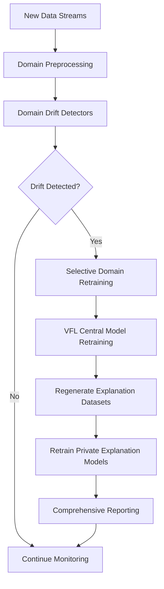

# 3.11 Drift Detection and Automated Retraining

## 3.11.1 Overview

This section documents the end-to-end drift monitoring and automated retraining framework implemented for the VFL credit scoring system. The framework continuously monitors model health across four domains — `auto_loans`, `credit_card`, `digital_savings`, and `home_loans` — detects drift along multiple dimensions, and triggers selective retraining and downstream updates when drift is detected.

## 3.11.2 Architecture



- **Domain Detectors**: Specialized detectors per domain encapsulate preprocessing, model scoring, and drift computation.
- **Drift Dimensions**: Statistical drift (input features), prediction drift (output distributions), and performance drift (confidence/quality).
- **Orchestration**: An automated pipeline evaluates drift, retrains only affected domains, updates the central VFL model, refreshes explanation datasets, and saves reports.

## 3.11.3 Drift Dimensions and Metrics

- **Statistical Drift (Input features)**
  - Method: Kolmogorov–Smirnov (KS) tests per feature vs baseline
  - Outputs: number of features with drift, percent drifted, per-feature details
- **Performance Drift**
  - Method: Change in model confidence/uncertainty vs baseline
  - Outputs: baseline vs current average confidence, relative change, flag
- **Prediction Drift (Outputs)**
  - Method: KS test between baseline and current prediction distributions
  - Outputs: KS statistic, p-value, shift magnitude, flag

## 3.11.4 Domain-Specific Detectors

Each domain provides a detector class with: preprocessing, model prediction wrapper, generic drift computation, and a human-readable report generator.

- **Auto Loans (Neural Network)**
  - Detector: `AutoLoansDriftDetector`
  - Report fields include model info, statistical drift, performance drift, prediction drift, and recommendations.

- **Digital Savings (Neural Network, Classification)**
  - Detector: `DigitalSavingsDriftDetector`
  - Includes label encoder/scaler handling, classification confidence tracking.

- **Home Loans (Neural Network, Regression)**
  - Detector: `HomeLoansDriftDetector`
  - Regression-focused predictions and confidence drift.

- **Credit Card (XGBoost, Classification)**
  - Detector: `XGBoostDriftDetector`
  - Derived feature creation, tree model metadata in reports.

### Example of report sections produced

```startLine:239:endLine:263:VFLClientModels/drift_detection_retraining/auto_loans_drift_detector.py
1. Statistical Drift (KS Test):
   - Features with drift: {statistical_drift['features_with_drift']}
   - Total features checked: {statistical_drift['total_features']}
   - Drift detected: {statistical_drift['drift_detected']}
   - Drift percentage: {(statistical_drift['features_with_drift']/statistical_drift['total_features']*100):.1f}% of features drifted{feature_drift_details}

2. Performance Drift (Confidence):
   - Baseline avg confidence: {drift_results['performance_drift']['baseline_avg_confidence']:.3f}
   - Current avg confidence: {drift_results['performance_drift']['current_avg_confidence']:.3f}
   - Confidence drift: {drift_results['performance_drift']['confidence_drift']:.2%}
   - Drift detected: {drift_results['performance_drift']['drift_detected']}

3. Prediction Drift (KS Test):
   - KS statistic: {drift_results['prediction_drift']['ks_statistic']:.3f}
   - P-value: {drift_results['prediction_drift']['p_value']:.3f}
   - Prediction shift: {drift_results['prediction_drift']['prediction_shift']:.3f}
   - Drift detected: {drift_results['prediction_drift']['drift_detected']}
```

## 3.11.5 Orchestration and Automation

The `AutomatedRetrainingPipeline` coordinates all domain checks and subsequent actions.

```startLine:147:endLine:180:VFLClientModels/drift_detection_retraining/automated_retraining.py
    def check_drift_and_retrain(self):
        """
        Main function to check for drift across all domains and trigger selective retraining
        """
        self.logger.info("🔍 Starting domain-specific drift check and retraining assessment...")
        ...
        # Check drift for each domain
        for domain_name, domain_config in self.domain_config.items():
            self.logger.info(f"🔍 Checking drift for {domain_name.upper()} domain...")
            drift_detected, reason = self._check_domain_drift(domain_name, domain_config)
            if drift_detected:
                ...
        # Perform selective retraining
        if domains_needing_retraining:
            ...
        # Generate comprehensive report
        self._save_drift_summary_report(drift_reports, retrained_domains)
```

- **Domain-aware preprocessing**: e.g., specialized preprocessing for `digital_savings` prior to detection.
- **Selective retraining**: Only models with drift are retrained; central VFL retrains after successful domain updates.
- **Scheduling**: Daily scheduled monitoring supported; manual trigger available.

## 3.11.6 Outputs and Reporting

- **Per-domain detailed reports**: Saved under `VFLClientModels/reports/` with timestamps. Example path format: `auto_loans_drift_report_YYYYMMDD_HHMMSS.txt`.
- **Comprehensive executive report**: Summarizes domain drift status, retraining actions, VFL updates, and next steps.
- **Console and logfile outputs**: Emoji-enhanced, UTF-8-safe logging for readability; safe-print used in fallback paths.

### Example: saving a report from a detector pipeline

```startLine:541:endLine:549:VFLClientModels/drift_detection_retraining/auto_loans_drift_detector_pipeline.py
with open(report_filename, 'w', encoding='utf-8') as f:
    f.write(report)

print(f"\n📄 Detailed report saved to: {report_filename}")
```

## 3.11.7 Configuration

The orchestration layer maintains domain configurations for datasets, models, and detector classes.

- Data paths: current and baseline CSVs
- Model paths: per-domain trained artifacts
- Detector classes: domain-specific implementations
- Retraining scripts: invoked when drift is detected

### 3.11.7.1 Drift Detection Parameters and Thresholds

The drift detection system uses standardized thresholds across all domains to ensure consistent monitoring and alerting. The following configuration parameters govern the sensitivity and behavior of drift detection:

#### **Default Thresholds (All Domains)**

| **Drift Type** | **Threshold Value** | **Description** | **Method Used** |
|----------------|---------------------|-----------------|-----------------|
| **Statistical Drift** | `0.1` | KS test p-value threshold | Kolmogorov-Smirnov test per feature |
| **Performance Drift** | `0.15` | MAE increase threshold | Model confidence/uncertainty change |
| **Distribution Drift** | `0.2` | Distribution similarity threshold | Wasserstein distance (normalized) |
| **Prediction Drift** | `0.25` | Prediction distribution drift | KS test on prediction distributions |

#### **Domain-Specific Configurations**

All four domains use the **same threshold values** for consistency:

- 🚗 **Auto Loans** (`AutoLoansDriftDetector`)
- 💳 **Credit Card** (`XGBoostDriftDetector`) 
- 🏦 **Digital Savings** (`DigitalSavingsDriftDetector`)
- 🏠 **Home Loans** (`HomeLoansDriftDetector`)

#### **Additional Configuration Parameters**

```python
# Monitoring Configuration
'monitoring_frequency': 'daily'           # How often to check for drift
'retrain_threshold': 3                    # Number of drift detections before retraining
'baseline_window': 30                     # Days for baseline calculation  
'detection_window': 7                     # Days for drift detection window
```

#### **Drift Detection Methods and Thresholds**

1. **Statistical Drift** 📊
   - **Method**: Kolmogorov-Smirnov (KS) test
   - **Threshold**: p-value < 0.1
   - **Output**: Features with drift, total features, drift percentage
   - **Rationale**: 10% significance level balances sensitivity with false positive reduction

2. **Performance Drift** ⚡
   - **Method**: Change in model confidence/uncertainty
   - **Threshold**: 15% relative change
   - **Output**: Baseline vs current confidence, relative change
   - **Rationale**: 15% threshold captures meaningful performance degradation

3. **Distribution Drift** 📈
   - **Method**: Wasserstein distance (normalized by feature range)
   - **Threshold**: 20% normalized distance
   - **Output**: Distribution similarity score
   - **Rationale**: 20% threshold indicates significant distribution shifts

4. **Prediction Drift** 🎯
   - **Method**: KS test on prediction distributions
   - **Threshold**: p-value < 0.25
   - **Output**: KS statistic, p-value, prediction shift magnitude
   - **Rationale**: 25% threshold for predictions is more lenient than feature drift

#### **Custom Configuration Override**

Thresholds can be customized per environment by creating a JSON configuration file:

```json
{
    "drift_thresholds": {
        "statistical_drift": 0.05,        # More strict (5% instead of 10%)
        "performance_drift": 0.1,         # More strict (10% instead of 15%)
        "distribution_drift": 0.15,       # More strict (15% instead of 20%)
        "prediction_drift": 0.2           # More strict (20% instead of 25%)
    },
    "monitoring_frequency": "hourly",     # More frequent monitoring
    "retrain_threshold": 2                # Retrain after 2 drift detections
}
```

#### **Threshold Selection Rationale**

- **Statistical Drift (0.1)**: Standard significance level in statistical testing
- **Performance Drift (0.15)**: Captures meaningful model degradation without noise
- **Distribution Drift (0.2)**: Indicates significant feature distribution changes
- **Prediction Drift (0.25)**: More lenient for output changes to avoid over-alerting

#### **Key Configuration Features**

- **Consistent thresholds** across all banking domains ensure uniform monitoring
- **Configurable parameters** allow environment-specific tuning
- **Automated retraining** triggers after 3 drift detections by default
- **Daily monitoring** provides regular model health checks
- **Selective retraining** minimizes computational overhead

## 3.11.8 Integration with VFL Model and Explanations

When any domain retrains successfully:
- The central VFL model is retrained to incorporate updated domain representations.
- Explanation datasets are regenerated and private explanation models are retrained to keep interpretability consistent with the refreshed models.

## 3.11.9 Usage

- Programmatic (manual):
  - Initialize the pipeline and call `check_drift_and_retrain()`.
- Scheduled:
  - Start scheduled monitoring to run daily at a configured time.

## 3.11.10 Design Choices and Rationale

- Multi-dimensional drift detection provides better coverage than feature-only tests.
- Domain-specialized preprocessing improves robustness and reduces false positives.
- Selective retraining minimizes compute cost and downtime.
- UTF-8-safe, emoji-enabled logs enhance operator visibility in long-running jobs.

## 3.11.11 Limitations and Future Enhancements

- Add multivariate distribution tests (e.g., PSI, KL divergence) for richer statistical drift analysis.
- Incorporate concept drift via periodic labeled holdout evaluation where available.
- Adaptive thresholds based on seasonality and historical drift patterns.
- Canary evaluation prior to production replacement of models.

## 3.11.12 Conclusion

The implemented drift detection and automated retraining framework delivers continuous model quality assurance across all domains. It detects drift along inputs, predictions, and performance, triggers selective retraining, updates the central VFL model, and refreshes explanation artifacts — maintaining both predictive performance and explainability over time while minimizing operational overhead.
