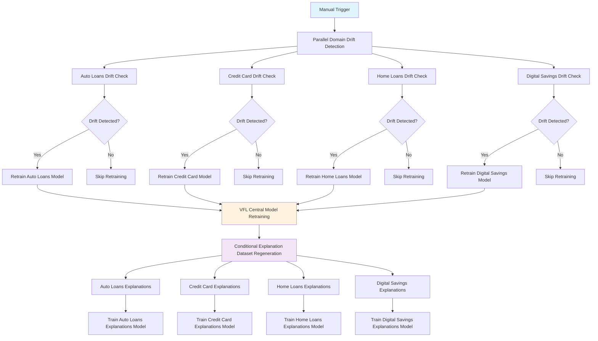
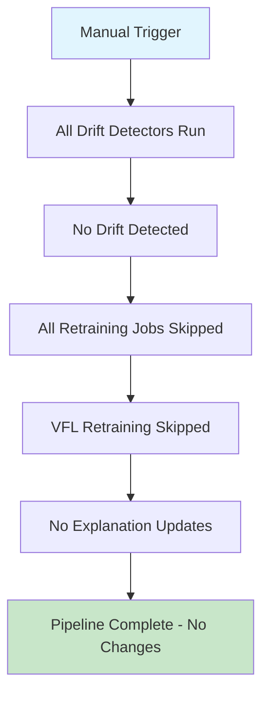
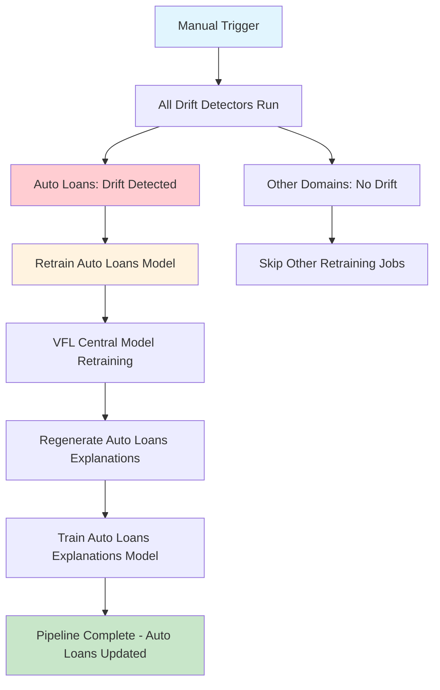
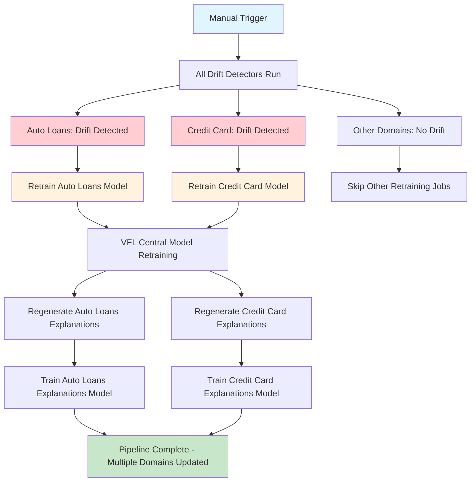

# 3.12 Retraining Pipeline: Flows and Conditionalities

## 3.12.1 Overview

This section documents the comprehensive retraining pipeline implemented through GitHub Actions workflows for the VFL credit scoring system. The pipeline orchestrates automated drift detection, selective model retraining, VFL central model updates, and explanation model refresh across all banking domains with sophisticated conditional logic and dependency management.

### **Current Implementation: GitHub Actions**

The retraining pipeline is currently implemented using **GitHub Actions**, which provides:
- **Workflow Orchestration**: YAML-based pipeline definitions with conditional logic
- **Parallel Execution**: Simultaneous drift detection across all domains
- **Conditional Job Execution**: Smart skipping of unnecessary retraining steps
- **Integration**: Native integration with code repositories and version control
- **Scalability**: Cloud-hosted runners with automatic resource management

### **Alternative Implementation Options**

While GitHub Actions is the current choice, the pipeline architecture is **tool-agnostic** and can be implemented using other workflow orchestration tools:

#### **Apache Airflow**
- **DAG-based Workflows**: Directed Acyclic Graphs for complex dependency management
- **Rich Scheduling**: Cron-based, interval-based, and event-driven triggers
- **Monitoring**: Built-in web UI with detailed execution tracking
- **Extensibility**: Python-based operators and custom plugins
- **Enterprise Features**: Role-based access control, audit logging

#### **Prefect**
- **Python-Native**: First-class Python support with decorators and type hints
- **Dynamic Workflows**: Runtime workflow generation and modification
- **State Management**: Persistent state tracking and checkpointing
- **Hybrid Execution**: Local, cloud, and hybrid deployment options
- **Modern Architecture**: Built for ML/AI workflows with data dependencies

#### **Other Alternatives**
- **Jenkins**: Traditional CI/CD with extensive plugin ecosystem
- **Argo Workflows**: Kubernetes-native workflow engine
- **Kubeflow Pipelines**: ML-specific workflow orchestration
- **Azure DevOps**: Enterprise-grade pipeline management
- **GitLab CI/CD**: Integrated with GitLab repositories

### **Migration Considerations**

The pipeline can be migrated to alternative tools by:
1. **Preserving Logic**: Maintaining the same conditional execution patterns
2. **Adapting Syntax**: Converting YAML conditions to tool-specific syntax
3. **Maintaining Dependencies**: Ensuring proper job sequencing and triggers
4. **Preserving Outputs**: Capturing drift detection results for conditional logic

## 3.12.2 Pipeline Architecture



## 3.12.3 Pipeline Stages and Flow

### **Stage 1: Drift Detection (Parallel Execution)**

All four domain drift detectors run simultaneously to maximize efficiency:

```yaml
# Auto Loans Drift Detection
detect-auto-loan-drift:
  runs-on: ubuntu-latest
  outputs:
    auto_loan_drift_detected: ${{ steps.check.outputs.auto_loan_drift_detected }}

# Credit Card Drift Detection  
detect-credit-card-drift:
  runs-on: ubuntu-latest
  outputs:
    credit_card_drift_detected: ${{ steps.check.outputs.credit_card_drift_detected }}

# Home Loans Drift Detection
detect-home-loan-drift:
  runs-on: ubuntu-latest
  outputs:
    home_loan_drift_detected: ${{ steps.check.outputs.home_loan_drift_detected }}

# Digital Savings Drift Detection
detect-digital-savings-drift:
  runs-on: ubuntu-latest
  outputs:
    digital_savings_drift_detected: ${{ steps.check.outputs.digital_savings_drift_detected }}
```

**Key Features:**
- **Parallel Execution**: All detectors run simultaneously on separate runners
- **Output Capture**: Each detector captures drift status as workflow output
- **Independent Processing**: No dependencies between detection jobs

### **Stage 2: Conditional Model Retraining**

Each domain model retraining is conditionally executed based on drift detection results:

```yaml
retrain-auto-loan:
  needs: detect-auto-loan-drift
  if: needs.detect-auto-loan-drift.outputs.auto_loan_drift_detected == 'true'
  runs-on: ubuntu-latest
  outputs:
    retrained: ${{ steps.set_output.outputs.retrained }}
```

**Conditional Logic:**
- **Dependency**: `needs: detect-auto-loan-drift` - waits for drift detection completion
- **Condition**: `if: needs.detect-auto-loan-drift.outputs.auto_loan_drift_detected == 'true'`
- **Execution**: Only runs if drift was detected in the specific domain
- **Output**: Captures retraining completion status

**Retraining Jobs:**
1. **Auto Loans**: `python VFLClientModels/models/auto_loans_model.py`
2. **Credit Card**: `python VFLClientModels/models/credit_card_xgboost_model.py`
3. **Home Loans**: `python VFLClientModels/models/home_loans_model.py`
4. **Digital Savings**: `python VFLClientModels/models/digital_savings_model.py`

### **Stage 3: VFL Central Model Retraining**

The central VFL model retraining is triggered when ANY domain model is successfully retrained:

```yaml
retrain-vfl-model:
  needs:
    - retrain-home-loan
    - retrain-digital-savings
    - retrain-credit-card
    - retrain-auto-loan
  if: |
    always() &&
    (needs.retrain-home-loan.result == 'success' || 
     needs.retrain-digital-savings.result == 'success' ||
     needs.retrain-auto-loan.result == 'success' || 
     needs.retrain-credit-card.result == 'success')
  runs-on: ubuntu-latest
```

**Conditional Logic:**
- **Dependencies**: Waits for ALL retraining jobs to complete (regardless of success/failure)
- **Condition**: `always() && (any_retraining_successful)` - runs if at least one domain was retrained
- **Purpose**: Ensures VFL model incorporates updates from any retrained domain models

**VFL Retraining Command:**
```bash
python VFLClientModels/models/vfl_automl_xgboost_homoenc_dp.py
```

### **Stage 4: Explanation Dataset Regeneration**

Explanation datasets are regenerated only for domains that were retrained:

```yaml
regenerate-auto-loans-explanations:
  needs: 
    - retrain-vfl-model
    - retrain-auto-loan
  if: |
    always() &&
    (needs.retrain-auto-loan.result == 'success')
  runs-on: ubuntu-latest
```

**Conditional Logic:**
- **Dependencies**: 
  - `retrain-vfl-model` - ensures VFL model is updated first
  - `retrain-auto-loan` - waits for specific domain retraining
- **Condition**: `always() && (domain_retraining_successful)` - only for successfully retrained domains
- **Purpose**: Regenerates explanations using updated VFL model and domain models

**Dataset Regeneration Commands:**
1. **Auto Loans**: `python VFLClientModels/models/explanations/privateexplanations/auto_loans_feature_predictor_dataset.py`
2. **Credit Card**: `python VFLClientModels/models/explanations/privateexplanations/credit_card_feature_predictor_dataset.py`
3. **Home Loans**: `python VFLClientModels/models/explanations/privateexplanations/home_loans_feature_predictor_dataset.py`
4. **Digital Savings**: `python VFLClientModels/models/explanations/privateexplanations/digital_bank_feature_predictor_dataset.py`

### **Stage 5: Explanation Model Training**

Private explanation models are trained using the regenerated datasets:

```yaml
train-auto-loans-explanations:
  needs: regenerate-auto-loans-explanations
  if: |
    always() &&
    (needs.retrain-auto-loan.result == 'success')
  runs-on: ubuntu-latest
```

**Conditional Logic:**
- **Dependencies**: `regenerate-auto-loans-explanations` - waits for dataset regeneration
- **Condition**: `always() && (domain_retraining_successful)` - only for retrained domains
- **Purpose**: Trains new explanation models on updated datasets

**Model Training Commands:**
1. **Auto Loans**: `python VFLClientModels/models/explanations/privateexplanations/train_auto_loans_feature_predictor.py`
2. **Credit Card**: `python VFLClientModels/models/explanations/privateexplanations/train_credit_card_feature_predictor.py`
3. **Home Loans**: `python VFLClientModels/models/explanations/privateexplanations/train_home_loans_feature_predictor.py`
4. **Digital Savings**: `python VFLClientModels/models/explanations/privateexplanations/train_digital_bank_feature_predictor.py`

## 3.12.4 Conditional Logic Patterns

### **Pattern 1: Drift-Based Conditional Execution**

```yaml
# Only execute if drift detected
if: needs.detect-domain.outputs.domain_drift_detected == 'true'
```

**Use Cases:**
- Domain model retraining
- Prevents unnecessary computation when no drift exists

### **Pattern 2: Success-Based Conditional Execution**

```yaml
# Only execute if previous step succeeded
if: needs.retrain-domain.result == 'success'
```

**Use Cases:**
- Explanation dataset regeneration
- Explanation model training
- Ensures downstream steps only run for successfully updated domains

### **Pattern 3: Any-Success Conditional Execution**

```yaml
# Execute if any of multiple jobs succeeded
if: |
  always() &&
  (needs.job1.result == 'success' || needs.job2.result == 'success')
```

**Use Cases:**
- VFL central model retraining
- Triggers when at least one domain needs updating

### **Pattern 4: Dependency Chain with Conditions**

```yaml
needs: 
  - upstream-job-1
  - upstream-job-2
if: |
  always() &&
  (needs.upstream-job-1.result == 'success')
```

**Use Cases:**
- Multi-stage processes with selective execution
- Ensures proper sequencing while maintaining conditional logic

## 3.12.5 Pipeline Execution Scenarios

### **Scenario 1: No Drift Detected**



**Execution Flow:**
1. All drift detectors complete (no drift found)
2. All retraining jobs are skipped due to `if: false` conditions
3. VFL retraining is skipped (no successful retraining jobs)
4. Pipeline completes without any model updates

### **Scenario 2: Single Domain Drift**



**Execution Flow:**
1. Auto Loans drift detected, others show no drift
2. Only Auto Loans model is retrained
3. VFL central model retraining executes (one successful retraining)
4. Only Auto Loans explanations are regenerated and retrained
5. Other domains remain unchanged

### **Scenario 3: Multiple Domain Drift**



**Execution Flow:**
1. Multiple domains show drift
2. All affected domain models are retrained in parallel
3. VFL central model retraining executes (multiple successful retrainings)
4. Explanations for all retrained domains are regenerated and retrained
5. Comprehensive system update across multiple domains

## 3.12.6 Error Handling and Resilience

### **Failure Scenarios**

1. **Drift Detection Failure**
   - Individual detector failures don't block other domains
   - Failed detectors are treated as "no drift detected"

2. **Model Retraining Failure**
   - Failed retraining jobs don't block VFL updates
   - Only successful retrainings trigger downstream steps

3. **VFL Retraining Failure**
   - Blocks explanation dataset regeneration
   - Prevents inconsistent state between models and explanations

4. **Explanation Generation Failure**
   - Individual domain failures don't affect other domains
   - Failed explanations can be regenerated in subsequent runs

### **Recovery Mechanisms**

- **Always Conditions**: Use of `always()` ensures downstream steps can evaluate even if upstream jobs fail
- **Result Checking**: `needs.job.result == 'success'` prevents execution on failed dependencies
- **Independent Domains**: Each domain's pipeline is independent, allowing partial recovery

## 3.12.7 Performance and Scalability

### **Parallelization Benefits**

- **Drift Detection**: All domains checked simultaneously
- **Model Retraining**: Independent domain retraining (when drift detected)
- **Explanation Generation**: Parallel processing for multiple domains

### **Resource Optimization**

- **Conditional Execution**: Only necessary jobs run
- **Selective Updates**: Only changed domains trigger full pipeline
- **Efficient Dependencies**: Minimal blocking between independent operations

## 3.12.8 Monitoring and Observability

### **Pipeline Visibility**

- **Job Status**: Clear success/failure indicators for each stage
- **Conditional Logic**: Transparent execution paths based on drift detection
- **Dependency Tracking**: Visual representation of job relationships

### **Debugging Support**

- **Output Variables**: Drift detection results captured as workflow outputs
- **Condition Evaluation**: Clear conditions for each job execution
- **Failure Isolation**: Failed jobs don't cascade to unrelated operations

## 3.12.9 Future Enhancements

### **Potential Improvements**

1. **Dynamic Thresholds**: Adjust drift thresholds based on historical patterns
2. **Rollback Capability**: Automatic rollback for failed retraining
3. **Performance Metrics**: Track pipeline execution time and resource usage
4. **Alerting**: Notifications for pipeline failures or successful updates
5. **A/B Testing**: Canary deployments for new models

### **Scalability Considerations**

- **Multi-Region Support**: Deploy across multiple geographic regions
- **Resource Scaling**: Dynamic resource allocation based on workload
- **Queue Management**: Handle multiple concurrent pipeline executions

## 3.12.10 Conclusion

The retraining pipeline implements a sophisticated, conditional workflow that maximizes efficiency while ensuring system consistency. By using drift detection as the primary trigger, the pipeline only executes necessary updates, reducing computational overhead and maintaining system reliability. The conditional logic patterns provide flexibility for different scenarios while maintaining proper dependency management and error handling.

The pipeline's design supports both incremental updates (single domain) and comprehensive updates (multiple domains) with appropriate downstream processing for each scenario. This ensures that the VFL credit scoring system remains current and accurate while minimizing operational disruption and resource consumption.
