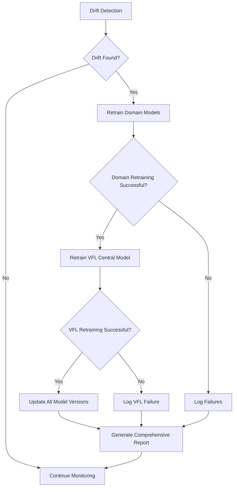

# VFL Central Model Integration with Automated Retraining

## Overview

The automated retraining pipeline has been enhanced to include **VFL (Vertical Federated Learning) central model retraining** after successful domain model updates. This ensures the entire credit scoring ecosystem remains optimally trained and synchronized.

## Integration Flow



## Key Features Implemented

### 1. **Automatic VFL Retraining Trigger**
- VFL central model automatically retrains when **any** domain model is successfully updated
- Ensures VFL model benefits from latest domain-specific improvements
- Maintains federated learning performance across all domains

### 2. **Intelligent Backup Strategy**
- **Domain Model Backups**: Selective backup of only retrained domain models
- **VFL Model Backups**: Comprehensive backup of all VFL artifacts before retraining
- **Timestamped Backups**: Easy rollback capability with date/time stamps

### 3. **Extended Timeout Handling**
- **Domain Models**: 1-2 hour timeout (depending on complexity)
- **VFL Central Model**: 3 hour timeout (complex federated training with AutoML)
- **Graceful Timeout Handling**: Proper cleanup and error reporting

### 4. **Comprehensive Reporting**
- **Executive Summary**: Includes VFL retraining status
- **Detailed Reports**: Separate sections for domain vs VFL retraining
- **Next Steps**: VFL-specific recommendations when applicable
- **Console Logging**: Real-time status updates with emoji indicators

## VFL Model Files Managed

### Backup and Version Control:
- `vfl_automl_xgboost_simple_model.keras` - Main VFL model
- `vfl_automl_xgboost_homomorp_model.keras` - Homomorphic encryption model  
- `best_hyperparameters_homoenc_dp.pkl` - Optimized hyperparameters
- `prediction_cache_homoenc_dp.pkl` - Cached predictions
- `auto_loans_scaler_homoenc_dp.pkl` - Auto loans feature scaler
- `digital_bank_scaler_homoenc_dp.pkl` - Digital banking feature scaler  
- `home_loans_scaler_homoenc_dp.pkl` - Home loans feature scaler

## Example Execution Flow

### Scenario: Credit Card Drift Detected

1. **Drift Detection**: Credit card domain shows statistical drift
2. **Domain Retraining**: `credit_card_xgboost_model.py` executes successfully
3. **VFL Trigger**: Automated pipeline detects successful domain update
4. **VFL Backup**: Current VFL models backed up to timestamped directory
5. **VFL Retraining**: `vfl_automl_xgboost_homoenc_dp.py` executes with 3-hour timeout
6. **Success Logging**: Both credit_card and vfl_central marked as successfully retrained
7. **Report Generation**: Comprehensive report includes both domain and VFL updates

## Error Handling

### Domain Retraining Failures
- VFL retraining **only** triggers if at least one domain model succeeds
- Failed domains are logged but don't block VFL updates
- Partial retraining is supported (some domains succeed, others fail)

### VFL Retraining Failures  
- Domain model updates are **preserved** even if VFL fails
- VFL failure is logged separately from domain failures
- Backup models remain available for manual rollback
- Next monitoring cycle can retry VFL retraining

## Benefits

### 1. **End-to-End Consistency**
- Ensures VFL model leverages latest domain-specific improvements
- Maintains optimal federated learning performance
- Prevents model drift between domain and central models

### 2. **Automated Maintenance**
- Zero manual intervention required for VFL updates
- Intelligent triggering only when needed
- Comprehensive backup and recovery strategy

### 3. **Enterprise-Grade Reliability**
- Robust error handling and timeout management
- Detailed logging and reporting for audit trails
- Graceful degradation when components fail

### 4. **Privacy-Preserving Updates** [[memory:4987543]]
- Maintains homomorphic encryption capabilities
- Preserves differential privacy features
- UTF-8 safe logging for international deployments

## Usage

The VFL integration is **automatically active** in the automated retraining pipeline. No additional configuration required.

### Manual Testing:
```python
from automated_retraining import AutomatedRetrainingPipeline

pipeline = AutomatedRetrainingPipeline()
pipeline.check_drift_and_retrain()  # Will include VFL retraining if domains updated
```

### Scheduled Monitoring:
```python
pipeline = AutomatedRetrainingPipeline()
pipeline.start_scheduled_monitoring()  # Includes VFL in daily drift checks
```

## Monitoring and Maintenance

### Log Files Generated:
- `automated_retraining_YYYYMMDD.log` - Main pipeline log
- `vfl_automl_xgboost_homoenc_dp_YYYYMMDD_HHMMSS.log` - VFL training log
- `drift_summary_report_YYYYMMDD_HHMMSS.txt` - Comprehensive drift report

### Key Metrics to Monitor:
- VFL retraining success rate
- VFL training duration (should be < 3 hours)
- Prediction cache updates
- Federated learning performance metrics

---

**Note**: This integration ensures that the VFL credit scoring system maintains optimal performance through consistent, automated updates of both domain-specific and federated learning components.